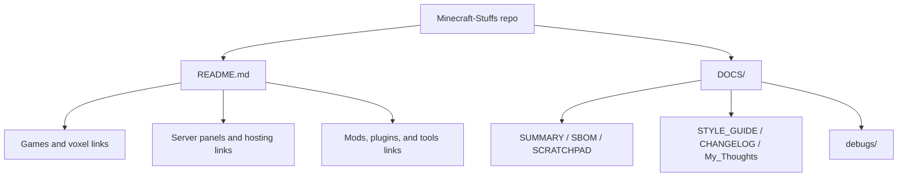

<!-- PRESERVATION RULE: Never delete or replace content. Append or annotate only. -->
# ARCHITECTURE

## Overview

`Minecraft-Stuffs` currently acts as an umbrella/index repo rather than a compiled
application or library. Its main job is to organize links, notes, and project-level
documentation around adjacent Minecraft work.

## Structure

- `README.md`: public-facing project catalog
- `DOCS/`: internal status, conventions, rationale, and maintenance notes
- `DOCS/debugs/`: timestamped issue logs when debugging work happens

## Diagram

## Current Boundary

- Linked repositories remain independent projects.
- This repo should not duplicate their source code unless there is a clear need for
  shared assets or cross-project documentation.
